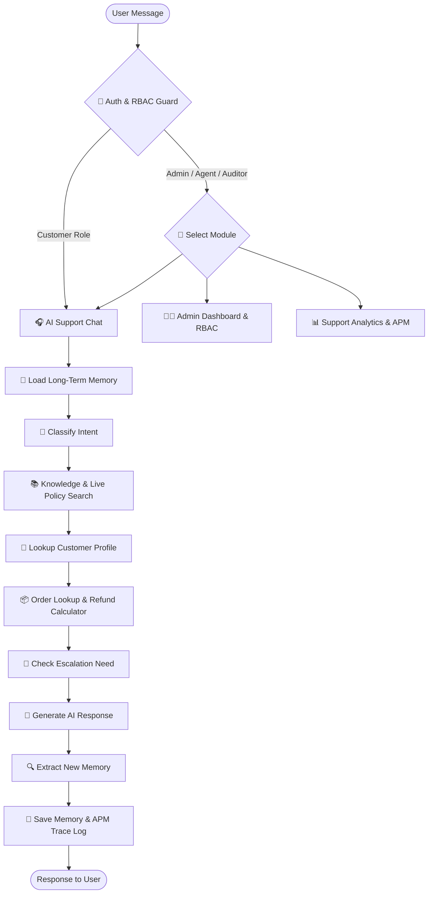

 HEAD
#  AI Customer Support & Resolution Agent

An AI-powered customer support assistant built using Python, Streamlit, LangGraph, LangChain, and Google Gemini.

This project simulates an intelligent customer support agent that can understand customer queries, identify intent, search a knowledge base, retrieve customer and order information, maintain conversation memory, generate personalized responses, and escalate critical issues to human support.

##  Features

-  AI-powered customer support chatbot
-  Short-term conversation memory
-  Long-term customer memory
-  Automatic intent classification
-  Knowledge-base search
- Customer information lookup
-  Order information lookup
-  Payment-related support
-  Refund and cancellation support
-  Shipping and delivery support
-  Warranty and repair support
-  Human escalation for critical issues
-  Support ticket creation
-  Personalized customer responses
-  Interactive Streamlit UI
-  SQLite-based persistence
-  Environment-variable based API configuration

##  How It Works

The application processes every customer query through an AI workflow built with LangGraph.

Customer Query
      ↓
Load Customer Memory
      ↓
Intent Classification
      ↓
Knowledge Base Search
      ↓
Customer Lookup
      ↓
Order Lookup
      ↓
Escalation Check
      ↓
Generate AI Response
      ↓
Extract New Memory
      ↓
Save Memory
      ↓
Final Customer Response

##  Tech Stack

| Technology | Purpose |
|------------|---------|
| Python | Core development |
| Streamlit | Web application interface |
| LangGraph | AI agent workflow |
| LangChain | LLM integration |
| Google Gemini | AI response generation |
| Pydantic | Structured data validation |
| SQLite | Memory and checkpoint persistence |
| JSON | Customer, order and ticket data |
| python-dotenv | Environment variable management |

## 📂 Project Structure

AI-customer-support-agent/
│
├── agent/
│   ├── __init__.py
│   ├── graph.py
│   ├── nodes.py
│   ├── prompts.py
│   ├── runtime.py
│   └── state.py
│
├── data/
│   ├── customers.json
│   ├── orders.json
│   └── tickets.json
│
├── database/
│   └── .gitkeep
│
├── knowledge_base/
│   ├── account_and_security.txt
│   ├── cancellation_policy.txt
│   ├── faq.txt
│   ├── payment_policy.txt
│   ├── refund_policy.txt
│   ├── shipping_policy.txt
│   └── warranty_and_repairs.txt
│
├── memory/
│   ├── __init__.py
│   ├── manager.py
│   └── runtime.py
│
├── tools/
│   ├── __init__.py
│   ├── customer_lookup.py
│   ├── escalation.py
│   ├── knowledge_search.py
│   ├── order_lookup.py
│   └── ticket.py
│
├── app.py
├── requirements.txt
├── .gitignore
└── README.md

##  Installation

### 1. Clone the Repository

git clone https://github.com/Jai3502/AI-customer-support-agent.git

cd AI-customer-support-agent

### 2. Create Virtual Environment

Windows:

python -m venv venv

Activate:

venv\Scripts\activate

macOS / Linux:

python3 -m venv venv

source venv/bin/activate

### 3. Install Dependencies

pip install -r requirements.txt

##  API Configuration

This project uses Google Gemini for AI-powered responses.

Create a `.env` file in the project root:

GOOGLE_API_KEY=your_google_gemini_api_key
GEMINI_MODEL=gemini-3.5-flash-lite

Replace `your_google_gemini_api_key` with your actual Gemini API key.

 Never upload your `.env` file to GitHub.

##  Run the Application

Start the Streamlit application:

streamlit run app.py

Then open the URL shown in the terminal.

Usually:

http://localhost:8501

##  Example Customer Queries

Where is my order ORD1001?

I want to cancel my order.

I was charged twice for the same order.

What is your refund policy?

My product arrived damaged. What should I do?

How long does shipping take?

I want to know about the warranty.

##  Intent Classification

The AI agent classifies customer queries into different categories.

Supported intents:

- FAQ
- ORDER
- PAYMENT
- REFUND
- CANCELLATION
- COMPLAINT
- OTHER

The system also uses a confidence score to determine whether a conversation should be escalated.

##  Knowledge Base

The project contains a local knowledge base with information related to:

- Account & Security
- Cancellation Policy
- Frequently Asked Questions
- Payment Policy
- Refund Policy
- Shipping Policy
- Warranty & Repairs

The AI agent searches the relevant knowledge before generating its response.

This helps the chatbot provide responses based on the application's available support information.

##  Memory System

The application uses two types of memory.

### Short-Term Memory

Short-term memory maintains the current conversation context.

This allows the chatbot to understand follow-up questions within the same conversation.

### Long-Term Memory

Long-term memory stores useful customer information that can be reused in future interactions.

This helps the agent provide more personalized customer support.

##  Human Escalation

Some customer issues should not be handled entirely by an AI system.

The agent can identify high-risk or sensitive situations and escalate them to human support.

Examples include:

- Fraud or scam reports
- Duplicate payments
- Serious complaints
- Legal threats
- Threat-related messages
- Low-confidence AI classifications

When escalation is required, the system can create a support ticket for human follow-up.

##  Customer Lookup

The application contains sample customer data in:

data/customers.json

The agent can use customer information to personalize responses.

##  Order Lookup

Order information is stored in:

data/orders.json

The agent can retrieve order-related information and answer customer questions about orders.

##  Ticket System

Support ticket information is maintained using:

data/tickets.json

The system can use tickets when an issue requires human support.

##  Security

The following files and folders should not be uploaded to GitHub:

.env
venv/
.venv/
__pycache__/
*.pyc
*.db
*.sqlite
*.sqlite3
.streamlit/secrets.toml

Make sure these are included in `.gitignore`.

##  Project Limitations

This is a portfolio / learning project and uses local JSON data and SQLite persistence.

It is not connected to a real production CRM, payment gateway, or order management system.

For production deployment, additional security, authentication, monitoring, database infrastructure, and API integrations would be required.

##  Future Improvements

-  User authentication
-  Admin dashboard
-  Customer support analytics
-  PostgreSQL database
-  Vector database / semantic search
-  Email integration
-  WhatsApp integration
-  Multi-language support
-  Cloud deployment
-  Automated testing
-  Performance monitoring
-  Role-based access control
-  Advanced AI agent tools

##  Learning Outcomes

Through this project, the following concepts are demonstrated:

- Generative AI
- LLM integration
- LangChain
- LangGraph
- Agentic AI workflows
- Prompt engineering
- Retrieval-based question answering
- Short-term memory
- Long-term memory
- Intent classification
- Structured outputs
- Customer support automation
- Human-in-the-loop escalation
- Streamlit application development
- SQLite persistence
- Python project architecture
GitHub:
https://github.com/Jai3502

Project Repository:
https://github.com/Jai3502/AI-customer-support-agent

## ⭐ Support

If you find this project useful, consider giving the repository a ⭐ star.

Thanks for checking out the project! 
=======
# 🎧 AI Customer Support & Resolution Agent

An intelligent, autonomous customer support agent built with **LangGraph**, **Gemini**, **Streamlit**, and **SQLite Dual-Layer Memory**. The system features **Performance APM Monitoring**, **Granular Role-Based Access Control (RBAC)**, **Advanced AI Agent Tools**, an **Admin Operations Desk**, **Customer Support Analytics**, intent classification, knowledge retrieval, order tracking, and automated human escalation.

---

## 🌟 Key Features

- 🐘 **PostgreSQL Relational Storage Engine**:
  - Relational database schema for `users`, `customers`, `orders`, `tickets`, `performance_logs`, `knowledge_vectors`, and `long_term_memories`.
  - Automatic migration, DDL initialization, and initial JSON dataset auto-seeding routines.
  - Dual-engine fallback architecture: automatically defaults to SQLite & JSON files if PostgreSQL is unconfigured or offline.
- 🎯 **Vector Database & Cosine Semantic Search**:
  - `pgvector` extension integration for high-dimensional vector embeddings (`vector(768)`).
  - Document chunking engine and vector embedding indexer for support articles in `knowledge_base/*.txt`.
  - Upgraded knowledge search (`search_knowledge_base`) using cosine-similarity semantic vector matching with score weighting.
  - Vector-based semantic memory retrieval (`search_memory_vectors`) for long-term customer context.
  - Interactive **Vector Semantic Search Playground** in the Admin Operations Desk.
- 📈 **Performance Monitoring & APM Telemetry**:
  - Step-by-step latency profiling across all LangGraph nodes (`classify_intent`, `retrieve_knowledge`, `lookup_order`, `generate_response`).
  - Real-time P95 latency, average execution time, and token consumption tracking (prompt + completion tokens).
  - Persistent execution trace logs and interactive APM telemetry dashboard.
- 🔑 **Granular Role-Based Access Control (RBAC)**:
  - Permission-enforced role matrix across **Super Admin**, **Support Agent**, **Compliance Auditor**, and **Customer**.
  - Action-level permissions (`delete_tickets`, `manage_roles`, `edit_customers`, `view_analytics`, `view_performance`).
  - User Role Manager in Admin Desk for dynamic role reassignment.
- 🤖 **Advanced AI Agent Tools**:
  - **Pro-Rated Refund & Fee Calculator**: Financial engine calculating 30-day return window eligibility, restocking fees (10%), tax adjustments, and generating instant store credit vouchers (`REFUND-XXXXXXXX`).
  - **Live Policy & Rule Search**: Dynamic policy lookup for shipping SLAs, price match rules, and brand warranty clauses.
  - **Hardware & Software Diagnostic Assistant**: Targeted troubleshooting for electronics, laptops, audio, and warranty claim eligibility.
- 🔐 **User Authentication & Session Security**:
  - Salted `SHA-256` password hashing, registration, and quick-select demo role authorization.
- 👨💼 **Admin Operations Dashboard**:
  - **Ticket Operations Desk**: Filter tickets by status & priority, assign agents, update resolution notes, and delete tickets.
  - **Customer Directory & Profile Manager**: View profiles, order history, long-term memory logs, update admin notes, and upgrade membership tiers.
  - **Order Oversight**: Track system orders and update fulfillment status (`Processing`, `Shipped`, `Delivered`, `Cancelled`).
  - **PostgreSQL & Vector DB Control Panel**: Inspect connection status, trigger table migrations, index document vectors, and query semantic vector embeddings.
- 📊 **Customer Support Analytics**:
  - Operational KPIs, resolution rates, ticket category distributions, customer tier breakdowns, order fulfillment status, database telemetry, and one-click CSV/JSON export.

---

## 🏗️ Architecture & Agent Execution Flow



---

## 📁 Project Structure

```text
ai-customer-support-agent/
├── agent/
│   ├── graph.py            # LangGraph state graph definition & edges
│   ├── nodes.py            # APM-profiled node logic (Intent, Memory, Knowledge, Escalation, Response)
│   ├── prompts.py          # System prompts for intent classification & memory extraction
│   ├── runtime.py          # Graph compilation with checkpointer & store
│   └── state.py            # TypedDict AgentState with APM latency & tool fields
├── views/
│   ├── admin_view.py       # Admin Operations Desk & RBAC Manager
│   ├── analytics_view.py   # Support Analytics & APM Telemetry Dashboard
│   ├── auth_view.py        # RBAC Login view & Quick Role Selectors
│   └── chat_view.py        # Support Chat Agent view
├── data/                   # JSON data persistence (users, customers, orders, tickets, APM logs)
├── database/               # SQLite database files (checkpoints & long-term memory)
├── knowledge_base/         # Support articles & documentation
├── memory/
│   ├── manager.py          # MemoryManager interface for cross-session store
│   └── runtime.py          # Persistence initialization (SqliteSaver & SqliteStore)
├── tools/
│   ├── advanced_tools.py   # Refund calculator, policy search, & diagnostic assistant
│   ├── analytics.py        # KPI & chart data calculation engine
│   ├── customer_lookup.py  # Customer profile & notes query tools
│   ├── escalation.py       # Escalation decision tools
│   ├── knowledge_search.py # Knowledge base retrieval tools
│   ├── order_lookup.py     # Order tracking & status update tools
│   ├── performance.py      # APM telemetry performance monitoring tool
│   └── ticket.py           # Support ticket CRUD management tools
├── .env                    # Environment configuration (API keys)
├── app.py                  # Streamlit web application frontend & router
├── auth.py                 # RBAC matrix, authentication, & password security
└── requirements.txt        # Python package dependencies
```

---

## 🚀 Quick Start & Installation

### Prerequisites

- Python 3.10 or higher
- Google Gemini API Key ([Get an API key](https://aistudio.google.com/))

### 1. Clone & Set Up Workspace

```bash
git clone https://github.com/Jai3502/ai-customer-support-agent.git
cd ai-customer-support-agent
```

### 2. Create Virtual Environment & Install Dependencies

```bash
python -m venv venv
# On Windows:
venv\Scripts\activate
# On macOS/Linux:
source venv/bin/activate

pip install -r requirements.txt
```

### 3. Configure Environment Variables

Create a `.env` file in the root directory:

```env
GEMINI_API_KEY=your_google_gemini_api_key_here
```

### 4. Run the Streamlit Application

```bash
streamlit run app.py
```

Open your browser at `http://localhost:8501`.

### 🔑 Default RBAC Login Credentials

- **Super Admin**: Username `admin` | Password `admin123`
- **Support Agent**: Username `agent1` | Password `agent123`
- **Compliance Auditor**: Username `auditor1` | Password `auditor123`
- **Customer Account**: Username `rahul` | Password `customer123`

---

## 📜 License

Distributed under the MIT License. See `LICENSE` for more information.
 9c88888 (Upgrade AI customer support agent)
